# Introduction

VS Code remote development allows accessing virtual/remote machine file-system and development environment over SSH. The experience is similar to developing code natively on a host machine, however the code and development environment is located on a virtual/remote machine.

## Features

* Feels like developing code natively on a host machine
* Having access to development environment not available on host machine
* VS Code intellisense support for code navigation
* Opening VS Code built-in terminal automatically starts SSH session to virtual/remote machine


[[1-https://code.visualstudio.com/docs/remote/remote-overview]](https://code.visualstudio.com/docs/remote/remote-overview)

> NOTE:  
Please note that all the steps described in this blog are validated on a MacBook running latest Mac OS Monterey as host and VirtualBox (6.1.28) running Ubuntu 20.4 LTS as guest. Please feel free to comment, if you are facing any issues with the setup or using a different setup or found a better alternative :)

## Visual Studio Code

Visual Studio Code is a powerful code editor available for multiple operation systems like Mac OS, Linux and Windows. It has support for different programming languages and a in-built debugger.

### VS Code Remote Development

Visual Studio Code Remote Development enables you to use a virtual/remote machine as a development environment.

#### Remote development over SSH
The [remote SSH](https://marketplace.visualstudio.com/items?itemName=ms-vscode-remote.remote-ssh) makes it possible to access virtual/remote machine file-system and development environment over SSH. It is mandatory that the virtual/remote machine is running an SSH server.

# Setup

## Prepare the guest OS

Boot-up the guest OS (Ubuntu 20.04 in our case) and login. The steps described below needs to be done once and then onwards, there is no need to login to guest OS. Just boot-up the guest OS and start using VS Code remote development.

### Install VS Code

First thing first, follow the [instructions](https://code.visualstudio.com/docs/setup/linux#_debian-and-ubuntu-based-distributions) to install VS Code.

### Install SSH server

As described in [Introduction](#introduction), an SSH server must be running on the guest OS to use VS Code remote development. In a terminal, type:

```bash
sudo apt-get update
sudo apt-get install openssh-client
```

### Setting up firewall in guest OS

I strongly recommend setting up firewall on the guess OS. In a terminal, type:

* Install `ufw`

```bash
sudo apt-get update
sudo apt-get install ufw
```

* Allow SSH connections

```bash
sudo ufw allow ssh
```

* Enable `ufw`

```bash
sudo ufw enable
```

* List current `ufw` rules

```bash
sudo ufw status verbose
```

## On the host OS

### Install VS Code

If not already done then follow the [instructions](https://code.visualstudio.com/docs/setup/mac) to install VS Code.

### VS Code extensions

Install the following extensions:

* [Remote Development](https://marketplace.visualstudio.com/items?itemName=ms-vscode-remote.vscode-remote-extensionpack)
    * [Remote - SSH](https://marketplace.visualstudio.com/items?itemName=ms-vscode-remote.remote-ssh)
    * [Remote - SSH: Editing Configuration Files](https://marketplace.visualstudio.com/items?itemName=ms-vscode-remote.remote-ssh-edit)
* [C/C++](https://marketplace.visualstudio.com/items?itemName=ms-vscode.cpptools)

### SSH private/public key-pair

SSH identity (private/public key-pair) is required to authenticate and interact with SSH server in teh guest OS. Check if you already have SSH key-pair on your host OS. Run the following in a terminal:

```bash
ls -l ~/.ssh/
```

If the command lists any of the SSH private (id_rsa/id_ed25519) and public (id_rsa.pub/id_ed25519.pub) key-pairs respectively, then you already have SSH identity created for you. Skip the next step in this case.

### Generating SSH private/public key-pair

Follow the [instructions](https://docs.github.com/en/authentication/connecting-to-github-with-ssh/generating-a-new-ssh-key-and-adding-it-to-the-ssh-agent#generating-a-new-ssh-key) to generate a new SSH private/public key-pair.

### Enabling shared clipboard in Virtualbox

* Ensure that guest additions are installed in the guest OS
* Start Virtualbox on the host OS and click on `Settings`
* In the `General` tab and under `Advanced` section, set `Shared Clipboard` to either `Bidirectional` or `Host to Guest`.

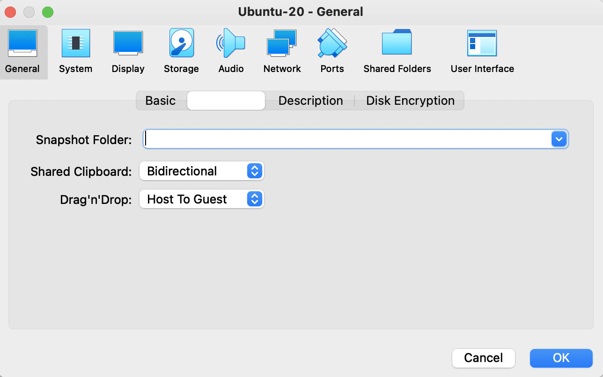

### Adding SSH public key to guest OS

Open your favorite editor and copy the contents of either `~/.ssh/id_rsa.pub` or `~/.ssh/id_ed25519.pub` based on the SSH key type used.

On the guest OS:

* Create a folder `~/.ssh`, if it doesn't already exist

```bash
mkdir -p ~/.ssh
```

* Create a file `authorized_keys` under `~/.ssh`

```bash
touch ~/.ssh/authorized_keys
```

* Open `~/.ssh/authorized_keys` in your favorite editor and paste the contents of SSH public key copied from the host machine

### SSH port forwarding

As described in the [article](https://forums.virtualbox.org/viewtopic.php?f=35&t=96608#p468775), `Bridged Adaptor` may not work with a host WiFi adapter. The [blog](https://support.apple.com/en-gb/guide/mac-help/mh43557/mac) on Apple support confirms it.

>  Note: You can’t use bridging if the physical network device used for bridging is a wireless device.

When `NAT` networking option is used in virtualbox, guest OS is hidden behind a NAT network. Therefore, it cannot be directly accessed using NAT ip address. Therefore, we use a really cool technique called `SSH port forwarding`.

* Start Virtualbox on the host OS and click on `Settings`
* In the `Network` tab, click on `Advanced` drop-down icon, then click on `Port Forwarding`

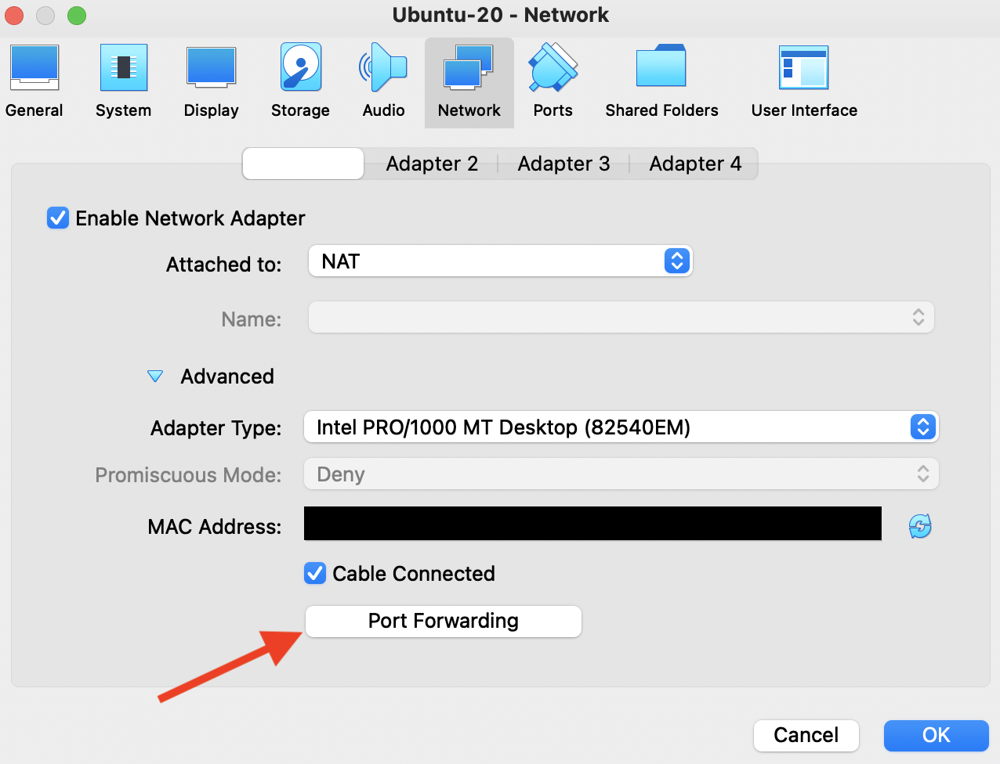

* Click on the `add` button as shown in the picture below
    * Add `ssh` to `Name` column
    * Select `TCP` in `Protocol` column
    * Leave `Host IP` as blank
    * Choose a higher number like `9022` as `Host Port`. SSH connection to this port will be redirected to guest OS by virtualbox
    * Leave `Guest IP` as blank
    * Set `Guest Port` as `22`
    * Click on `OK` to save the `SSH` settings
    * Click on `OK` to save the `networking` settings

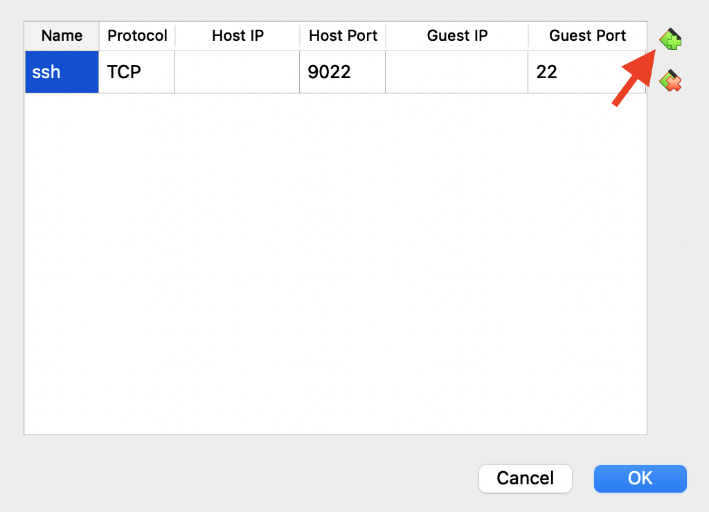

Hurray! You have set up everything needed to establish SSH connection between host and guest OS. Let's try it,

On the host OS, open a terminal and type:

```bash
ssh -p 9022 <guest OS user name>@localhost
```

if the connection is successful, then you should see,

> Welcome to Ubuntu 20.04.3 LTS (GNU/Linux 5.11.0-40-generic x86_64)
>
>  * Documentation:  https://help.ubuntu.com
>  * Management:     https://landscape.canonical.com
>  * Support:        https://ubuntu.com/advantage

If you see the error,

> ssh: connect to host localhost port 9022: Connection refused

then either guest OS is not started or you missed one of the above steps.

# VS Code remote development - SSH

Now that all the pre-requisites have been fulfilled, let's see all the cool stuff we can do with it.

## Establish connection to guest OS

* Click on `View` -> `Command Palette`
* Select `Remote-SSH: Add New SSH Host...`

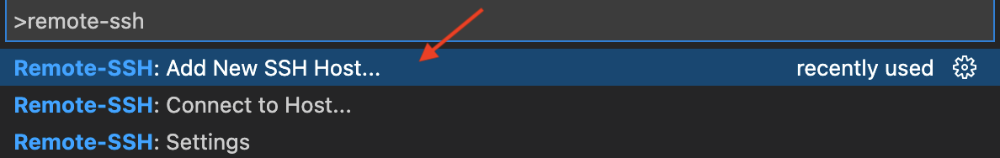

* Type in `ssh -p 9022 <guest OS username>@localhost`

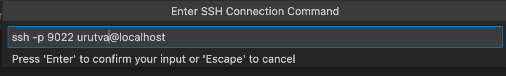

* Select the SSH config file to save the details

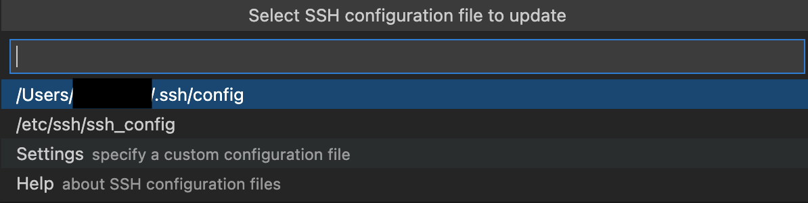

Once this is done, a new instance of VS Code is started and connection to guest OS is established. If this doesn't happen for some reason then you can manually connect to guest OS as follows:

* Click on `View` -> `Command Palette`
* Select `Remote-SSH: Connect to Host...`

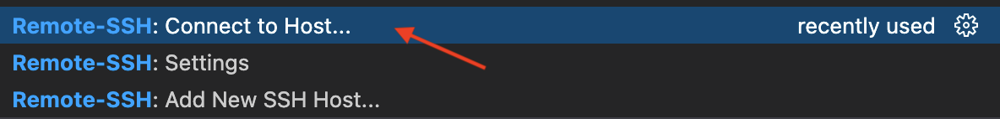

* Select `localhost`

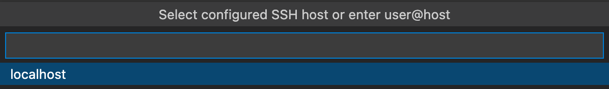

In the new instance of VS Code,

* Status bar should show `SSH: localhost`. It shows `localhost` because we are using SSH port forwarding from host OS (localhost) to guest OS.

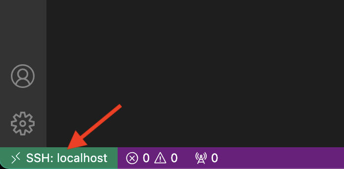

* The `OUTPUT` window shows logs related to SSH communication
    * Click on `View` -> `Output` to see the `OUTPUT` window

## Installing VS Code extensions remotely

With VS Code remote development, extensions installed on host OS can be installed on guest OS. In addition, all the extension installed on guest OS can be listed.

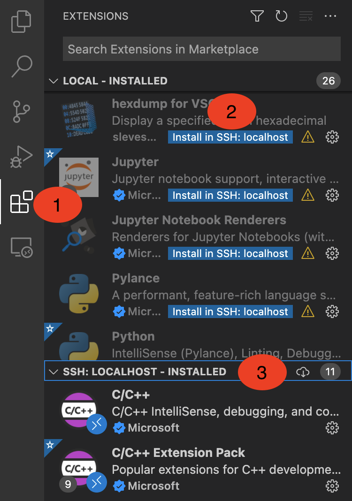

In order for VS Code intelliSense to work, ensure that [C/C++](https://marketplace.visualstudio.com/items?itemName=ms-vscode.cpptools) extension is installed on host and guest OS.

## Guest OS development environment

* Click on `File` -> `Open` or `Open Folder` to navigate to project folder and open it.

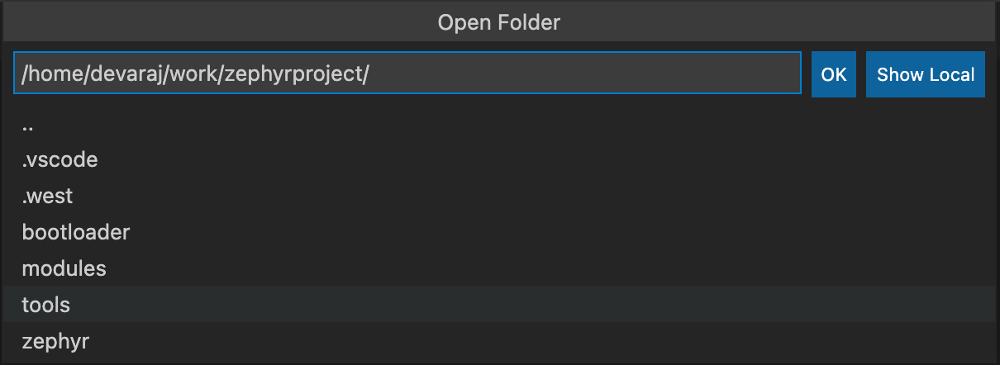

* Select the project folder and click on `OK` or press `ESC` to cancel

Now, you should be able to navigate through project source using the `Explorer` button on the top left.

## Terminal

Opening a terminal automatically starts an SSH connection to guest OS. Click on `Terminal` -> `New Terminal` and start building the project.

Happy coding!!!!!
